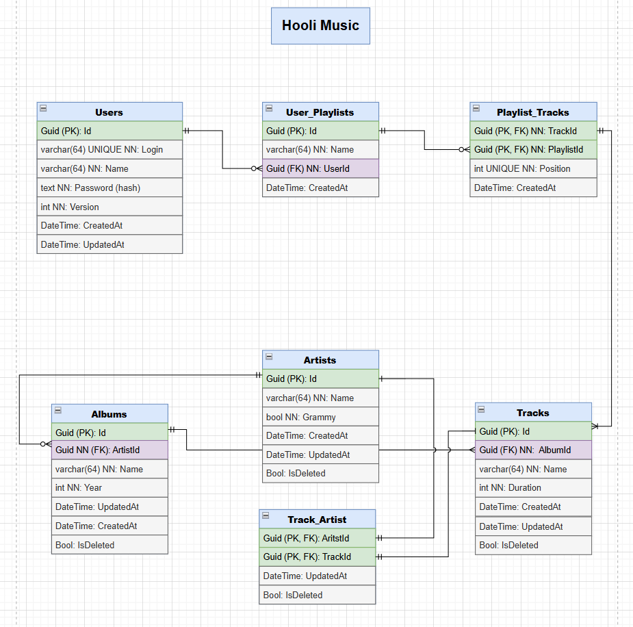

# Hooli Music

**Hooli Music** is a university project that demonstrates the principles of clean architecture, design patterns, using **ASP.NET Core**, **Entity Framework** , and **PostgreSQL**.
This service provides a comprehensive API for building personalized music libraries and managing associated metadata.
In this project, I implemented a lot of database operations and some complex queries that include joins, grouping, and filters in one request.
Description of complex request :

```csharp
return await context.Tracks.Include(t => t.TrackArtists)
            .ThenInclude(ta => ta.Artist)
            .Include(t => t.Album)
            .Where(t => t.IsDeleted == false)
            .OrderByDescending(t => t.CreatedAt)
            .Take(count)
            .ToListAsync();
````
**Equivalent SQL:**

```sql
SELECT TOP (@count)
    t.*,
    a.*,
    ar.*
FROM Tracks t
LEFT JOIN Albums a
    ON t.AlbumId = a.Id
LEFT JOIN TrackArtists ta
    ON t.Id = ta.TrackId
LEFT JOIN Artists ar
    ON ta.ArtistId = ar.Id
WHERE t.IsDeleted = 0
ORDER BY t.CreatedAt DESC;
```

This query retrieves a specified number of the latest tracks (from 1 to 30).
It also joins additional tables and uses their data to build a complete track information response.

## 🎯 Project Overview

- **Clean Architecture** implementation with separated layers (Core, Infrastructure, Services, API)
- **Repository Pattern** for data access abstraction
- **Soft Delete Pattern** for data
- **Dependency Injection** for loose coupling
- **RESTful API** design principles
- **Database-first** approach with Entity Framework Core migrations
- **Containerization** using Docker for simplified deployment
- **Database tests**


## 🚀 Technologies

- **.NET 8**
- **ASP.NET Core**
- **Entity Framework**
- **PostgreSQL**
- **Docker**

## Packages NuGet 
- **xunit** for tests
- **PostgreSQL**
- **EntityFrameworkCore**
- **JwtBearer**

---
## 📊 Database diagram


> 📄 Diagram file: `Hooli_Music.drawio` (open with [draw.io](https://draw.io))

## ▶️ Installation

**Initial start:**
1. Clone repository: `git clone https://github.com/Nikolas321654/Hooli_library.git`
2. `cd HomeLib`
3. `docker-compose up --build`
4. `dotnet ef database update --startup-project HomeLib.API --project HomeLib.Infrastructure`

**Start:** 
1. `cd HomeLib`
2. `docker-compose up --build`

**Stop:**
`docker-compose down`

**Start tests** 
1. `docker run --name homelib-postgres-test -e POSTGRES_PASSWORD=123456789 -p 5432:5432 -d postgres` 
2. `Start test in your's ide`    

**(http://localhost:8080)**

## 📚 Literature

- **Clean Code** — Robert C. Martin
- **Clean Architecture** — Robert C. Martin
- **Pro C# 10 with .NET 6: Foundational Principles and Practices in Programming** —  Andrew Troelsen, Phil Japikse
- **Design Patterns: Elements of Reusable Object-Oriented Software** — Gang of Four (GoF)
- **Learning PostgreSQL** - Salahaldin Juba, Achim Vannahme, Andrey Volkov
